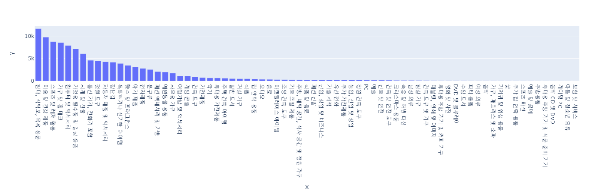
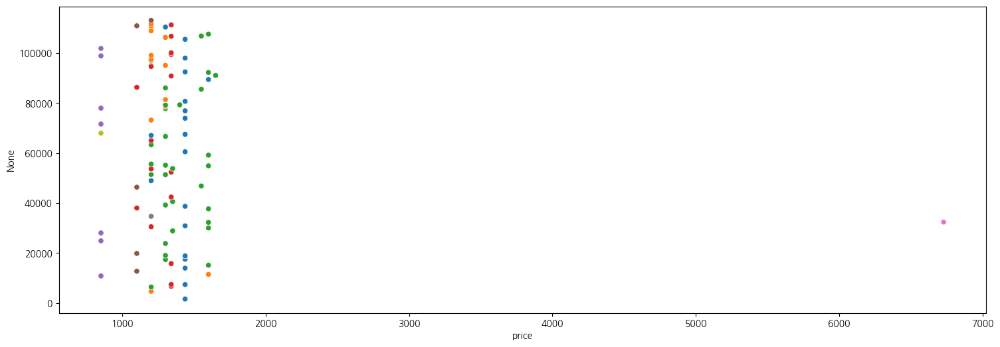

## 목차
- [목차](#목차)
- [데이터설명](#데이터-설명)
- [olist](#olist)
- [데이터 전처리](#데이터-전처리)
  - [데이터 병합](#데이터-병합)
  - [한글 처리](#한글-처리)
  - [결측치 처리](#결측치-처리)
  - [중복값처리](#중복값처리)
- [EDA](#eda)
- [분석](#분석)
    - [의문](#의문)
    - [가설](#가설)
        - [가설1](#가설-i)
        - [가설2](#가설-ii)
            - [가설2-1](#가설-ii-1)
        - [가설3](#가설-iii)
         - [가설4](#가설-iv)
            - [가설4-1](#가설-iv-1)
            - [가설4-2](#가설-iv-2)
- [결론](#결론)
- [프로젝트회고](#프로젝트회고)
- [후속연구](#후속연구)
- [데이터 정보](#데이터-정보)

## olist

- Olist는 브라질의 이커머스 플랫폼으로, 주로 중소기업과 대형 상점들이 온라인에서 제품을 판매할 수 있도록 돕는 서비스를 제공
- Olist는 브라질의 이커머스 플랫폼으로, 주로 중소기업과 대형 상점들이 온라인에서 제품을 판매할 수 있도록 돕는 서비스를 제공
- 주요특징
    1. 통합 관리: Olist는 여러 온라인 마켓플레이스와 통합되어 있어, 판매자들이 하나의 플랫폼에서 다양한 채널을 통해 제품을 관리하고 판매할 수 있습니다.

    2. 물류 지원: Olist는 물류 및 배송 서비스를 지원하여, 판매자들이 효율적으로 재고를 관리하고 주문을 처리할 수 있도록 돕습니다.

    3. 마케팅 도구: 플랫폼은 광고 및 프로모션 도구를 제공하여, 판매자들이 제품을 더 효과적으로 홍보하고 판매를 증진할 수 있도록 합니다.

    4. 분석 및 보고: 판매 성과를 분석하고 보고서를 생성할 수 있는 기능이 제공되어, 판매자들이 데이터를 기반으로 전략을 조정할 수 있습니다.

    5. 고객 지원: 고객 서비스와 관련된 도구와 기능도 제공되어, 판매자들이 고객 문의와 문제를 효과적으로 처리할 수 있습니다.


## 데이터 설명
    1. order_id : 주문 id
    2. order_item_id : 주문된 상품 id
    3. product_id : 상품 id
    4. seller_id : 판매자 id
    5. shipping_limit_date : 화물 적재 기한
    6. price : 가격
    7. freight_value : 배송료
    8. payment_sequential : 분할 결제 횟수
    9. payment_type : 결제 방식
    10. paymnet_installments : 할부 개월 수
    11. payment_value: 결제 금액
    12. review_id : 리뷰 작성자 id
    13. review_score : 리뷰 별점
    14. review_comment_title : 리뷰 제목
    15. review_comment_message : 리뷰 내용
    16. review_creation_date : 리뷰 작성 날짜
    17. review_answer_timestamp : 리뷰 답변 날짜
    18. prduct_category_name : 상품 카테고리명
    19. product_name_length : 상품 이름 길이
    20. product_description_length : 상품 설명 길이
    21. product_photos_qty : 상품 사진 갯수
    22. product_weight_g : 상품 무게
    23. product_length_cm : 상품 길이
    24. product_height_cm : 상품 높이
    25. product_width_cm : 상품 너비
    26. customer_id : 소비자 id
    27. order_status : 주문 상태
    28. order_purchase_timestamp : 주문 결제 날짜
    29. order_approved_at : 주문 승인
    30. order_delivered_carrier_date : 배송기사에게 상품이 전달된 날짜
    31. order_delivered_customer_date : 손님에게 배송 완료된 날짜
    32. order_estimated_delivery_date : 예상 배송일
    33. customer_unique_id : 소비자 고유 id
    34. customer_zip_code_prefix : 소비자 우편번호
    35. customer_city : 소비자가 사는 도시
    36. customer_state : 소비자가 사는 주
    37. seller_zip_code_prefix : 판매자 우편번호
    38. seller_city : 판매자가 있는 도시
    39. seller_state : 판매자가 있는 주

    + 각각의 EDA를 위한 추가 열

    40. deliver_date_diff : 예상 배송일과 실제 배송 완료된 날짜의 차이

## 데이터 전처리
### 데이터 병합
- geolocation 정보를 제외한 모든 데이터 병합
    - 데이터셋별로 _id컬럼을 통하여 join하여 병합
- 해당 분석에서 위치정보는 사용하지 않기에 제품, 소비자, 주문, 판매자의 데이터를 위주로 활용

### 한글 처리
- 데이터 이해를 위해 포르투칼어로 된 카테고리명을 한글화
    - 원어와 한글을 딕셔너리로 만들어 맵핑을 통하여 처리

### 결측치 처리
- 결측치는 크게 제품 카테고리와 배송일에서 발생
    - 제품 카테고리 :   
        - prduct_category_name : 상품 카테고리명
        - product_name_length : 상품 이름 길이
        - product_description_length : 상품 설명 길이
        - product_photos_qty : 상품 사진 갯수    

        제품ID, 즉 각각의 제품 정보는 있지만 이를 분류하는 카테고리가 누락된 부분이 존재. 제품ID를 통해서 어떤 제품인지 식별이 어렵기 때문에 카테고리를 통해 제품 구분이 어렵다면 사실상 어떤 제품인지 식별이 안되는 상황 -> 결측치를 제거하는 것으로 판단(dropna(axis = 1)).
    ---
    - 배송일 :
        - order_approved_at  15
        - order_delivered_carrier_date  758
        - order_delivered_customer_date  2008

        주문승인, 배달기사에게 전달된 날짜, 소비자에게 배송된 날짜가 각각 다르게 결측치가 발생하였는데 쇼핑몰이라는 특성상 주문과정에서 도착을 하지 않거나 결제 진행중이면 발생할 수 있는 결측치라는 판단. 본 발표에서는 제품 판매량에 대한 주제를 다룰 것이기에 도착이 완료된 제품에 한해서 진행. -> 결측치를 제거하는 것으로 판단(dropna(axis = 1)).


### 중복값처리
- 병합되면서 중복된 행을 제거(drop.duplicates())


## EDA
1. **카테고리별 판매량의 순위**
- 
- *침대, 식탁보, 목욕 용품*인 카테고리가 가장 많은 판매량을 보였고 *시계 및 선물* 카테고리까지 상대적으로 기울기가 큰 모습을 볼 수 있으며 이후엔 앞선 순위에 비해 기울기가 완만해지는 모습을 볼 수 있음.


2. **예상 배송일과 실제 배송일의 차이와 별점의 관계**
- 

- 배송 데이터에서 배송 예정일과 실제 배송일의 차이를 계산하고, order_id 기준으로 리뷰 데이터와 병합하여 별점과 배송일의 차이와의 관계를 알아보려 함.

- 병합한 데이터에서 배송일의 차이와 별점 데이터는 결측치가 있는 행을 삭제함.

- 배송일의 차이를 10단계로 계층을 나누어 그래프로 표현.

- 나누어 보니 확실히 *계층이 1일 때가(배송이 늦었을 때)* 별점이 확연히 낮았음


3. **결제 방법으로 구별한 구매자의 주별 결제 금액**
- 

- 고객의 지역적 특성과 결제 방식이 소비 금액에 미치는 영향을 분석
- 주별로 소비 금액(`price`)을 결제 방식(`payment_type`)에 따라 시각화하여, 지역별 소비 패턴과 결제 방식별 소비 금액의 차이를 파악

- 상파울루주가 가장 많은 소비금액을 기록


4. **사진 수에 따른 판매량 차이**
- 
- 1장 사용하는 제품이 압도적으로 많음.
- 급격히 감소해서 6장정도부터는 그 수가 매우 적음

## 분석

- ### 의문
- 
- 사이트 내에서 제품에 대한 **상세 설명**(사진, 글 등)이 **제품 판매량**에 영향을 주는가?


- ### 가설
    - #### 가설 I
        사진의 수는 판매량 순위에는 영향을 주지 않을 것이다.

        ##### 사진 1장~5장
   
        

        

        

        

        

    ```
    실제 사진의 수에 의해 순위에 변동이 생김 -> 가설 기각
    ```

    - #### 가설 II
        카테고리의 범위가 넓은만큼 제품의 금액대가 골고루 분포할 것이다.(저렴한 제품과 비싼 제품이 비슷한 비율로 포진되어 있을 것이다.)
        
        판매량이 가장 높은 *침대, 식탁보, 목욕 용품* 카테고리에서 상품의 금액대가 어떻게 분포되어 있는지 확인.

        ##### 가설 II-1 

        침대와 목욕 용품은 가격대가 상이하기 때문에 고가의 가격대가 사진이 늘어날수록 존재할 것이고 이는 침대일 가능성이 높다.

        

        

        

        

        

        실제로는 250 이하로 대부분의 값이 포진되어 있고 고가로 튀는 값이 존재하지만 이상치정도로 해당 사이트에서 주된 판매 상품으로 보기 어려움.

        - 사진이 많을수록 금액의 범위가 넓어짐(1장일 땐 최고가가 800정도였는데 늘어날수록 2000정도로 넓어짐), 4장일 땐 600으로 범위가 좁아지고 상품 수도 줄어듦.
        
        - 2000에 가까운 제품은 침대라고 추측이 되는데 이 역시 수가 매우 적기 때문에 골고루 포진되어 있다고 이야기하기 어려움.


        ##### 전체 카테고리 금액 분포
        
    ```
    제품이 골고루 분포하는 것이 아닌 1000이하에 대부분 몰려있고 특히 500이하에서 압도적인 분포를 보인다. 최고가는 7000정도이지만 그 값은 거의 없고 사이트에서 취급하는 가격이 비슷한 것을 확인할 수 있음. -> 가설 기각
    ```
    
    ```
    해당 카테고리는 1,2,3,5장일 땐 13위까지의 순위에 있는 반면 이후에는 10장까지도 순위권에 없음. 즉 이 카테고리의 순위에 변동이 생긴 요인은 제품의 가격 차이라기보다는 제품 자체의 성격이 아닐까라고 추측 -> 주로 가정에서 쓰는 일상 용품이기에 평점이 높거나 유명한 제품 등 이미 구매의사를 가지고 구매를 하고 상세정보가 이 구매 의사를 바꿀 정도의 영향을 미치기는 어려움.
    ```
        
    - #### 가설 III
        사진이 많다는 것은 상세한 설명을 하기 위함이고 비싼 제품일수록 상세한 설명을 할 것이다. 
        -> 사진이 많을수록 비싼 제품임으로 순위변동은 가격에 의해 발생했을 것이다.

        ##### 기준
        가설 II에서 보았듯 비싼 제품이 단순히 최고가 제품이라고 이야기하기는 어려움. 최고가 제품은 판매량 자체가 매우 적기에 해당 가설에서 사용하기는 다소 어려움. -> 상대적으로 비싼 가격을 정하고 카테고리를 특정하여 확인.

        카테고리별 가격평균의 최고가 : 1104
        카테고리별 가격 평균의 사분위수 [24.94096774,   78.48915254,  115.98817999,  153.0752381 ,1104.31768519]

        1000이상을 비싼 금액으로 기준을 정하고 이를 넘는 평균금액이 존재하는 카테고리를 조회한 결과 **PC** 카테고리가 부합

        

        

        

        

        

        -> 다른 카테고리에 비해 높은 가격대에 분포해있지만 사진 수가 늘어난다고 제품의 수가 많아진다고 이야기하기 어려움
    ```
    순위변동이 가격 때문에 발생했다고 이야기하기 어려움. -> 가설 기각
    ```
        
    - #### 가설 IV
        상품 설명의 길이는 사진과 비슷한 양상을 보일 것이다.

        

        

        

        

        

        ##### 가설 IV-1
        - 설명의 길이는 사진 갯수의 경우와 같이 특정 카테고리,가격대와 설명 길이의 관계가 없는가?
          - 설명의 길이를 qcut을 이용하여 구간을 나누어서 그래프로 시각화하여 비교해봤는데, 사진보다도 비례관계가 없는 것으로 보여짐.    
          - 위에서 예상한 사이트 자체의 특성, 사이트 방문의 이유들을 더욱 뒷받침해주는 근거가 되었음

        ##### 가설 IV-2
        - 설명의 길이도 늘어나면서 순위 변동이 생기지만, 사진의 경우와 같이 사이트를 들어온 소비자의 목적에 따라서 달라지는 것으로 보이고, TOP13의 변동도 거의 없음.
          - 순위 변동도 길이가 늘어나면서 특정한 카테고리가 올라오는 것이 아니라 구간마다 갑자기 판매량이 급등하는 경우가 있으므로 설명의 길이와는 관계가 있다고 보이지 않음.

## 결론
- 사진 수가 늘어나면서 순위 변동이 생기지만 이것이 제품의 판매량 순위라기 보다는 제품 구매를 하고자 하는 소비자가 원래 구매할 목적으로 들어온 상품과 사이트 내에서 정보를 얻어 구매하는 상품으로 나눠지는 것 같음

- 상품을 정해두고 구매하는 집단 : 사진이 적어도 판매량이 높고 사진수에 큰 영향을 받지 않음

- 정보를 얻어 구매하는 집단 : 순위권내에는 존재하지만 사진이 많아질수록 순위가 올라오는 경향이 있음

- *애초에 위 두 집단이 독립적인 집단이 아닌 기본적으로 상품을 구매할 목적은 있지만 구매과정에서 다른 제품에 대한 정보를 얻음으로해서 구매의사가 바뀌는 상품이 있는 것 같다고 추정(장난감, 미용...)

- *사이트 자체가 고가의 제품을 취급하기보다는 한국의 쿠팡과 비슷한 입지인 것 같고 저가의 제품에 대해서는 상세 설명이 제품 구매에 큰 영향을 안주는 거 같음


## 프로젝트회고

## 후속연구
- 해당 분석은 판매량과 금액을 가지고 진행한 분석이지만 브라질이라는 국가의 특징이나 배송관련된 문제 등 고려할 요인이 많다고 생각함. 


## 데이터 정보
- 데이터 출처 : [Brazilian E-Commerce Public Dataset by Olist](https://www.kaggle.com/datasets/olistbr/brazilian-ecommerce?resource=download&select=product_category_name_translation.csv)

